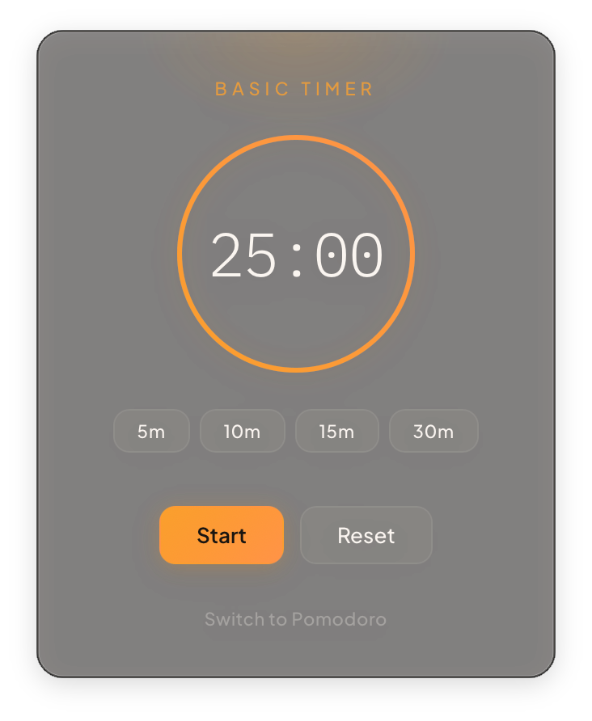
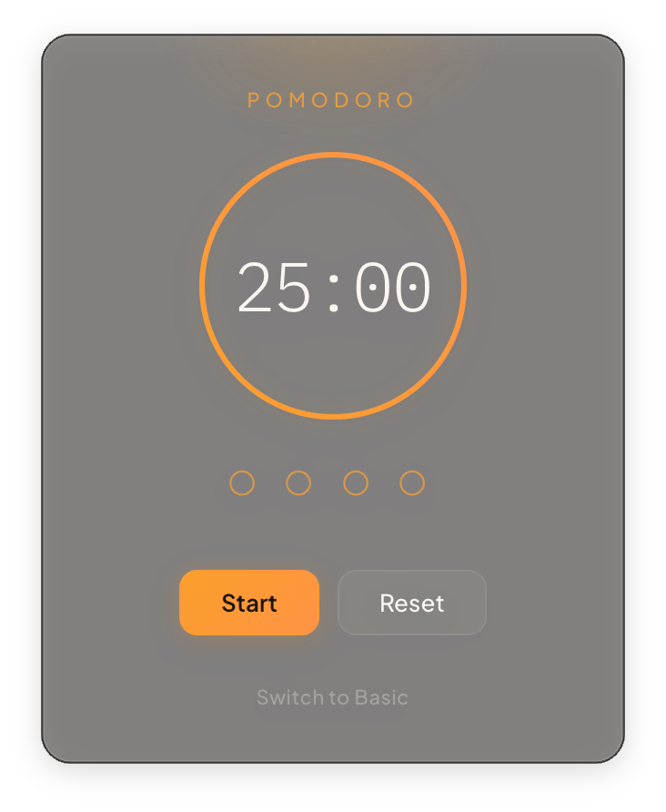
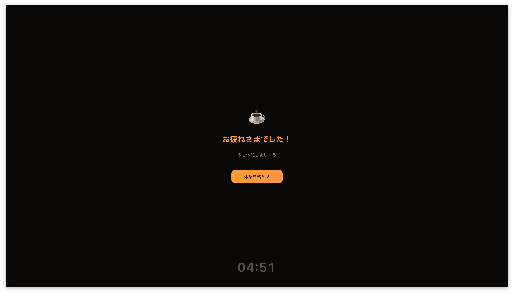

# mac-timer

macOS メニューバー常駐のタイマーアプリ（Tauri v2）

## Screenshots

| Basic Timer | Pomodoro |
|:-----------:|:--------:|
|  |  |

| Overlay (ポモドーロ完了時) |
|:-------------------------:|
|  |

## Static Analysis

コード変更後に以下をすべて実行してください。

```bash
# TypeScript
npx tsc --noEmit          # 型チェック
npm run lint              # ESLint

# Rust
cargo check --manifest-path src-tauri/Cargo.toml    # コンパイルチェック
cargo clippy --manifest-path src-tauri/Cargo.toml    # Lint
```
